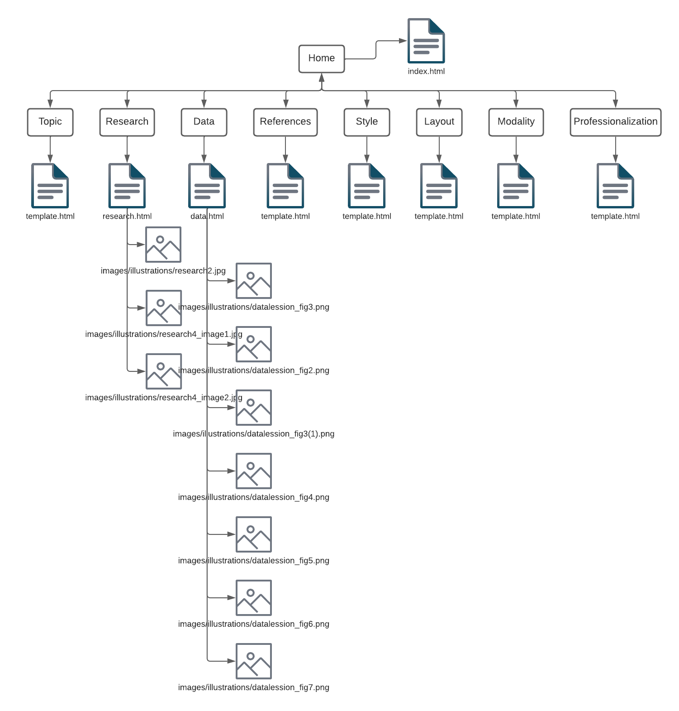

# The Research Paper Toolbox
by Varvara Bondarenko

[Link to github repo](https://github.com/udig-v/com421-project.git) 

## Sitemap

## Self-Critique
In this project, I chose to use a modular structure to make the text more easily readable. Each section of text is wrapped in a gray box, which makes it stand out and easier to find. However, I did face some challenges when it came to creating sidebars that looked good and aligned perfectly with the rest of the text. In the future, I would like to spend more time on this aspect and come up with a better solution.

The navigation tabs at the top of the page are fixed, which allows users to quickly navigate to different sections without having to scroll back up. However, the navigation bar on the side of the page could be improved. Currently, it takes up a lot of space and doesn't look very stylish. In the future, I would like to change it to a dropdown menu to make it more compact and consistent across all pages.

Another issue with the project is that the navigation page looks too wordy and is not easily readable. I would like to spend more time refining the design to make it more user-friendly and visually appealing.

Finally, I would like to try and have styles for all pages fit on one page, rather than having a separate stylesheet for the homepage. This would make it easier to maintain the site and ensure that all elements look consistent across all pages.